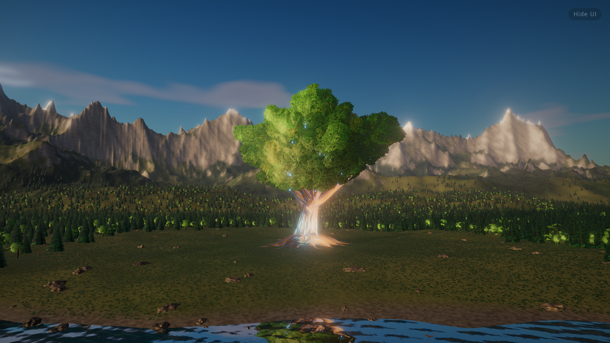
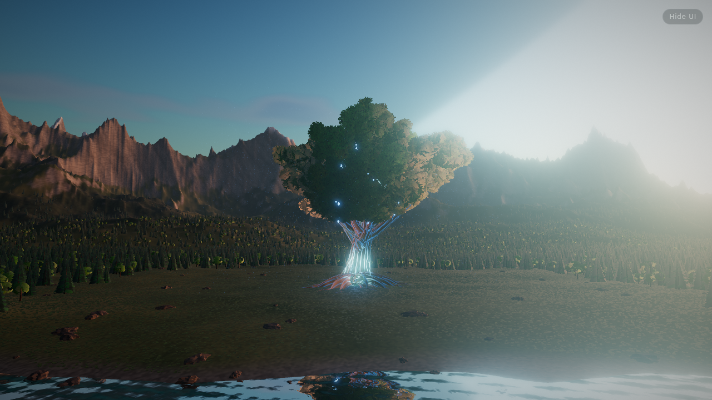
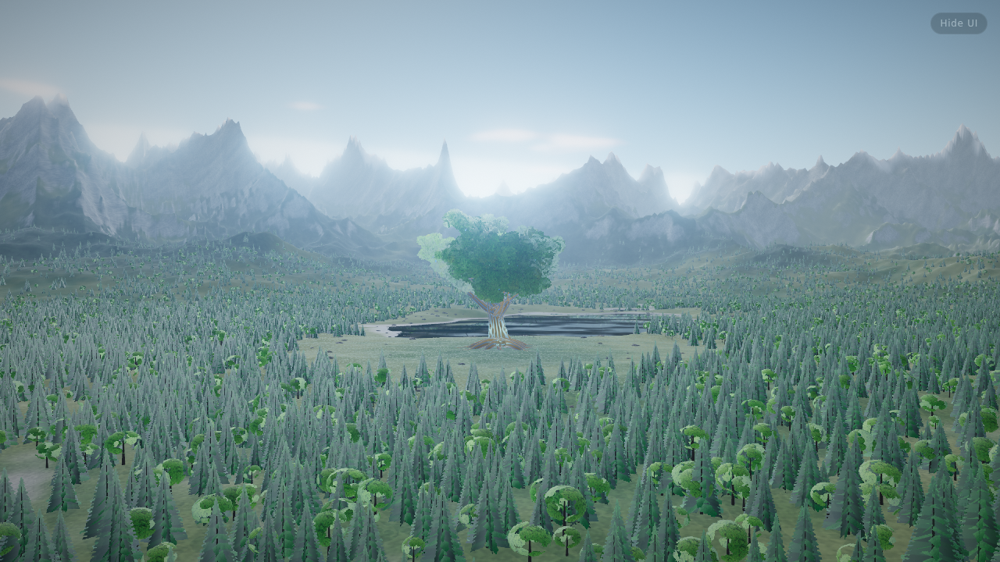
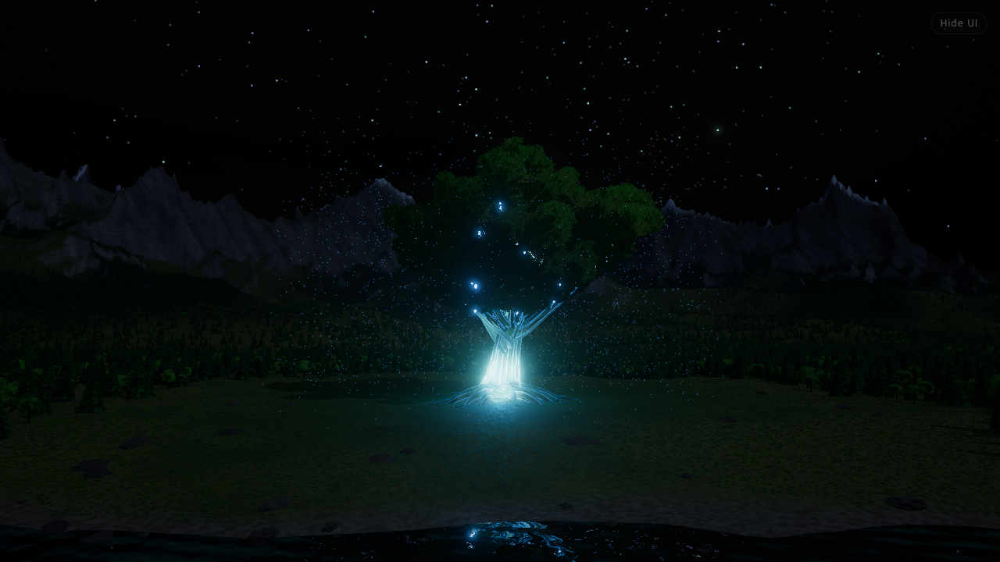
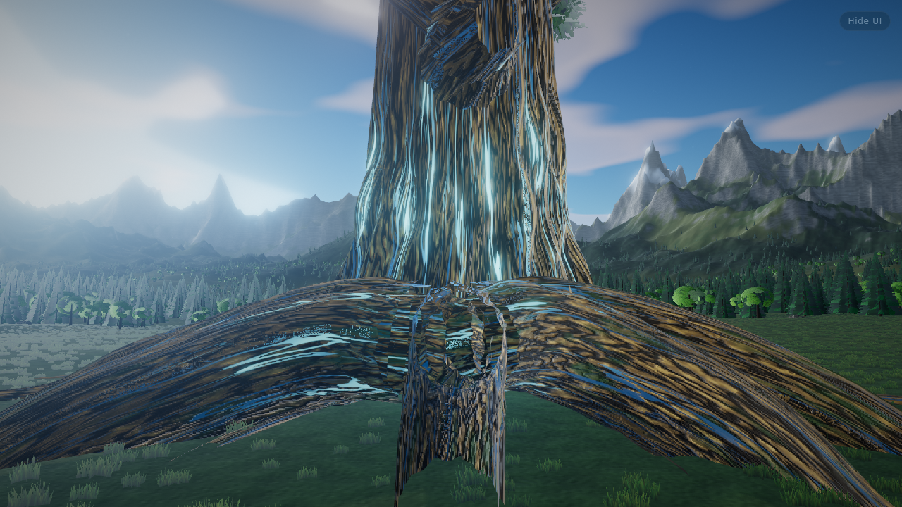

# The Aurelian Tree

A real-time Three.js scene of a 190 m golden-barked world tree with pulsing blue bioluminescent veins. It stands in a mountain valley beside a lake, and a slider sets the time of day.



| Dawn | Noon | Night |
|---|---|---|
|  |  |  |

Close-up of the bark and veins:



## Run it

```bash
npm install      # only needed for the screenshot tooling
npm start        # http://localhost:8080
```

Three.js loads from jsDelivr through an import map, so any static file server works. No build step.

- **Time of day**: drag the slider, pick a preset, or turn on *Time-lapse* (one in-game hour every six seconds).
- **Vein glow**: scales the bioluminescence.
- **Orbit**: slow automatic camera orbit.
- **Performance mode**: reloads with about half the trees and a lower render resolution (`#low` in the URL does the same).
- `H` hides the controls.

## How it's made

Every asset is generated in code when the page loads. There are no image, model or texture files.

| Piece | File | Technique |
|---|---|---|
| Valley, lake basin, mountains | `src/terrain.js` | Simplex fBm and ridged noise heightfield on a 640×640 grid, dense near the tree and coarse at the horizon. Shader blends grass, forest cover, rock, snow and shore mud by slope and height, with procedural bump detail. |
| World tree | `src/worldTree.js` | Recursive branch skeleton (trunk, leaders, 9 limbs, secondary and tertiary branches, 13 roots) swept into tube meshes with root flare and buttresses. The bark shader uses seamless periodic gradient noise, anti-aliased by screen footprint, for furrows, plates, moss and gold crests. Veins are meandering channels with capillaries, and emissive pulses travel from the root tips to the crown. About 3,800 foliage clumps with crown-scale occlusion, plus glowing seed pods, drifting spores and blue point lights. |
| Forest, grass, boulders | `src/forest.js` | Instanced firs (branch cards plus crossed silhouette cores) and broadleaf trees, 42k grass tufts and displaced-icosphere rocks. Wind sway and sun translucency in the foliage shader. Only near trees cast shadows. |
| Sky and light | `src/sky.js` | Preetham sky with clouds from `three/addons`, sun path by hour, atmospheric sun colour from air mass, moon and stars. Image-based lighting comes from a PMREM of the sky, and the fog colour is probed from the sky's horizon. |
| Lake | `src/main.js` | `three/addons` `Water` reflections with a generated tileable normal map. |
| Textures | `src/textures.js` | Oak leaf clumps, fir sprays and silhouettes, grass tufts, water normals and glow sprites, all drawn on canvas. |
| Post | `src/main.js` | 4× MSAA HDR target, bloom thresholded against sky brightness, ACES tone mapping, vignette and grain. |

## Tooling

- `npm run shoot -- out.png 17.4` renders a headless screenshot at 17:24. Instead of an hour you can pass a JSON list of shots; see `scripts/shoot.mjs`.
- `npm run build:artifact` writes `dist/artifact.html`, which is the page without its document skeleton, for hosts that add their own.
