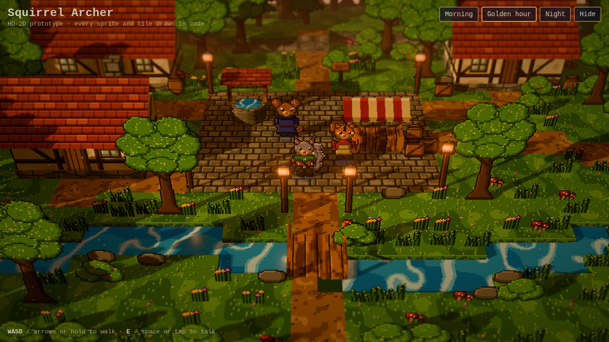
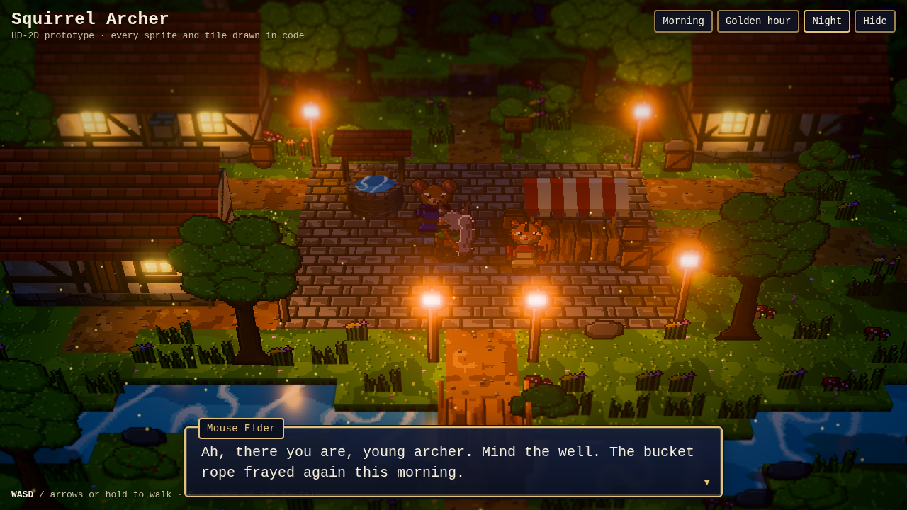
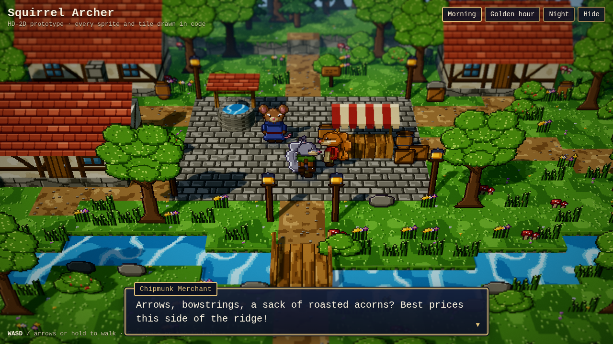
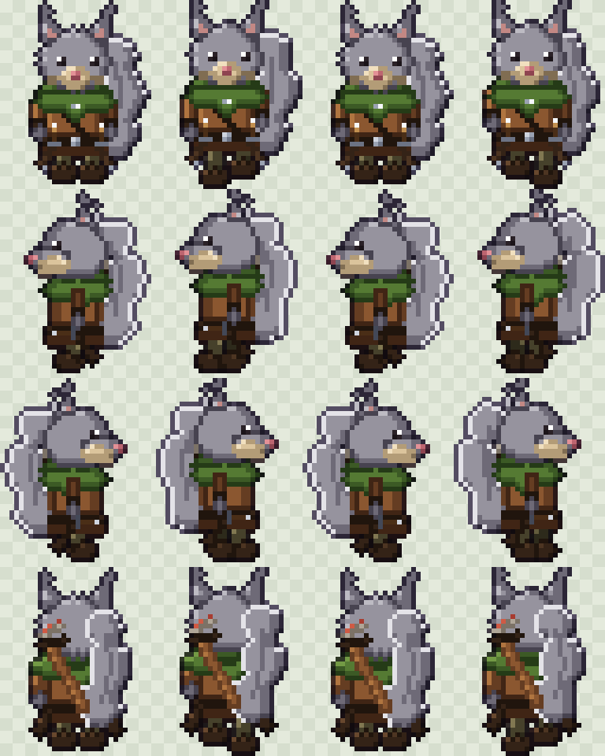
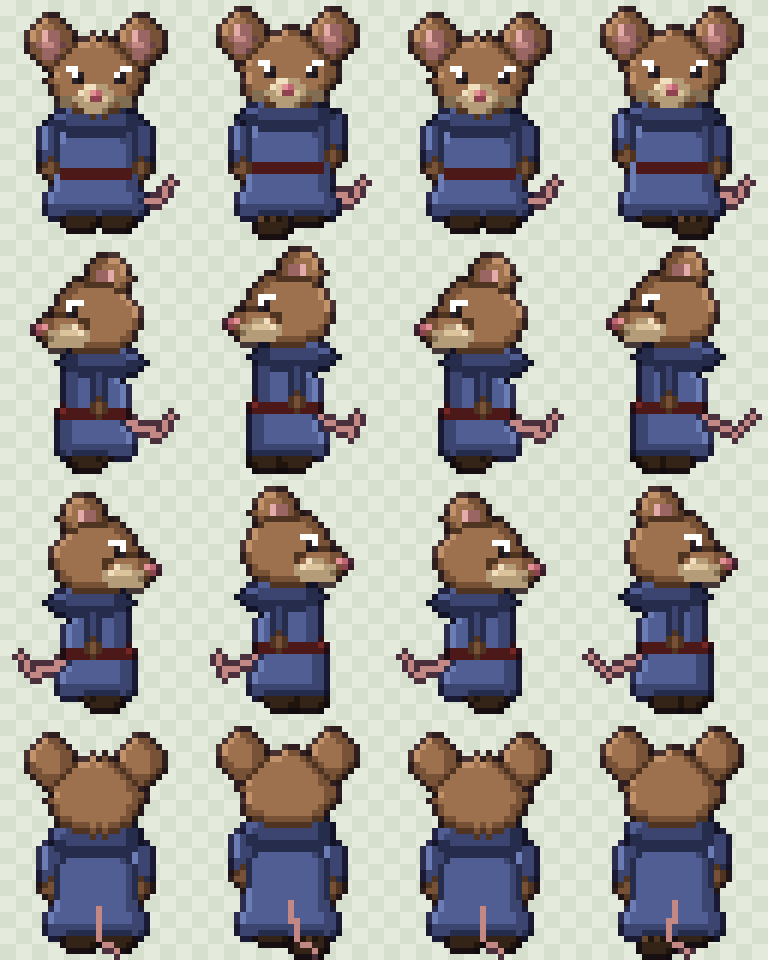
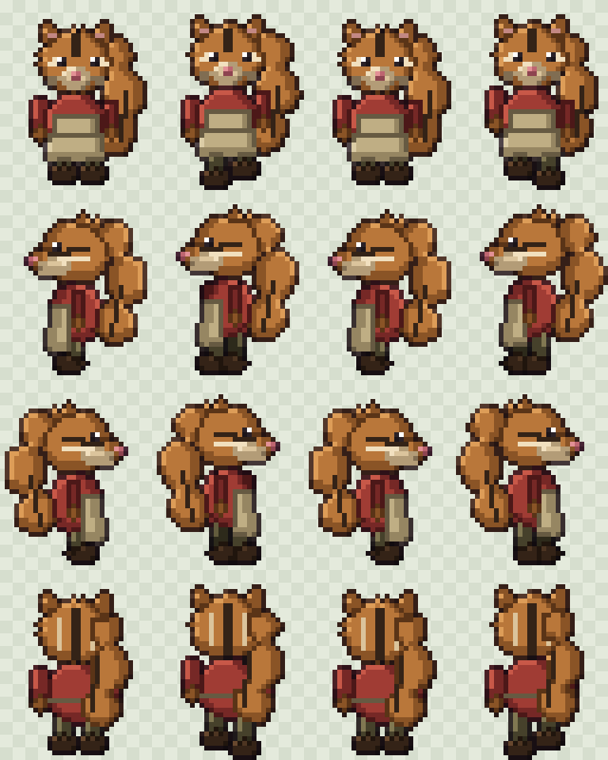
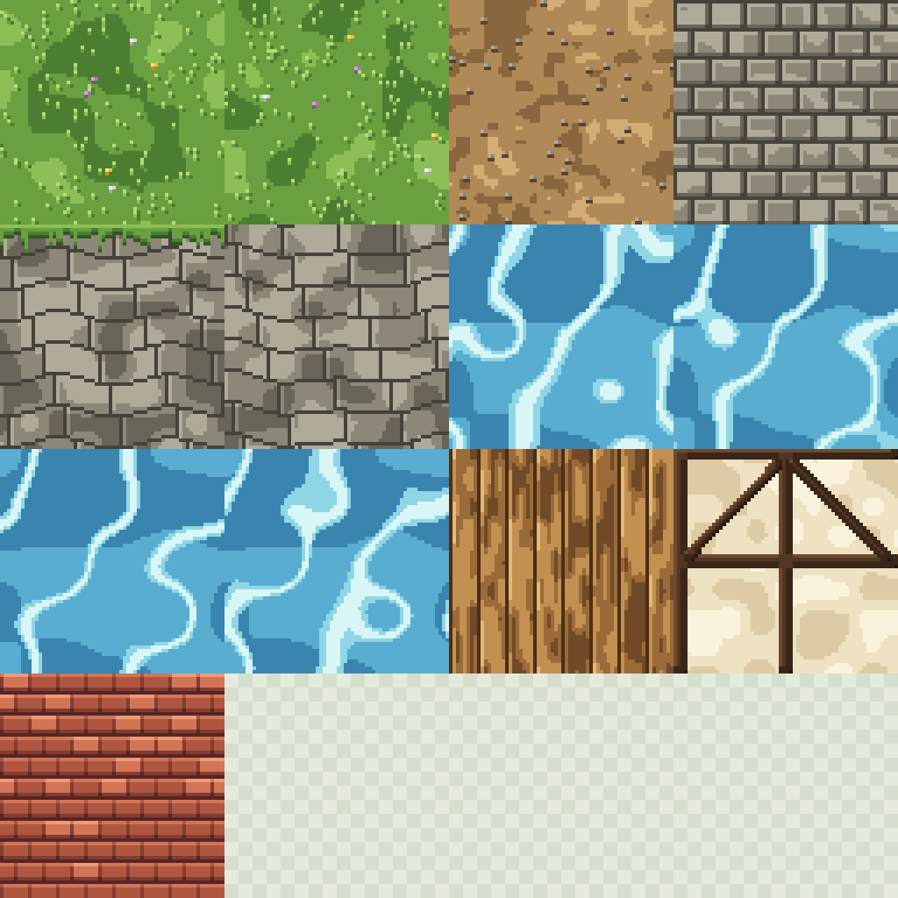
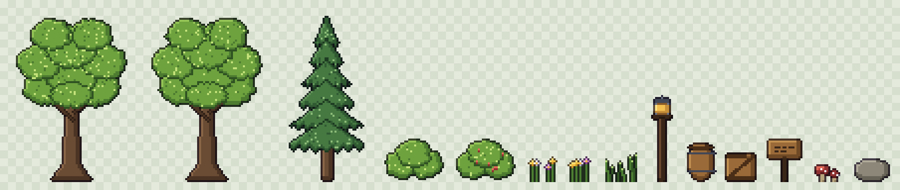

# Squirrel Archer: HD-2D prototype

A small playable village in the HD-2D style: pixel-art characters and props standing in a lit 3D diorama, with tilt-shift blur, bloom and three times of day. **Every sprite, tile and texture is drawn by code.** There are no image files in the source; the PNGs in `assets/` are exported from the same code.



| Night, talking to the elder | Morning at the market stall |
|---|---|
|  |  |

## The sprite sheets

The gray squirrel archer: leather jerkin and trousers, green hooded capelet, two belt daggers, and a quiver with red-fletched arrows (seen from the side and back). Rows are down, left, right and up; columns are the four walk frames.



The same generator with different species and outfit settings makes the rest of the cast, so everyone shares one style:

| Mouse elder | Chipmunk merchant |
|---|---|
|  |  |

Tileset (grass, dirt, cobbles, cliff with grass lip, rock face, four water frames, planks, timber-frame wall, roof tiles) and props:




Native-size PNGs, ready to import into Godot or any other engine, are in `assets/`. Each character frame is 32×40 px, and tiles are 64×64 px (16 px per world unit).

## Run it

From the repo root:

```bash
npm start            # then open http://localhost:8080/hd2d/
```

- **Move:** WASD or arrow keys, or hold the mouse or a finger where you want to walk.
- **Talk:** E, Space or Enter near a character, or tap them. The same key advances the dialogue.
- **Time of day:** Morning, Golden hour and Night buttons.

## How the art is made

`src/pixel.js` holds the shared style rules, which is what keeps every asset consistent:

- every colour comes from a 5-tone ramp in one palette,
- light always comes from the top-left, so each shape gets a highlight edge and a shadow edge automatically,
- where one part overlaps another, a dark "ink" line separates them,
- each silhouette gets a selective outline (a darkened version of the colour next to it).

`src/rodents.js` builds a character from parts (head, ears, muzzle, body, arms, legs, tail) drawn as shapes, then shaded by those rules. Species (squirrel, chipmunk, mouse) change ears, tail, fur and markings. Outfits (archer, robe, merchant) change the clothes and gear. A new character is a few lines of settings.

`src/tiles.js` makes seamless textures from periodic noise and draws the props (oaks, pines, bushes, flowers, lanterns, barrels, crates, signpost, mushrooms, rocks) with the same ramps.

`src/world.js` turns a tile grid into 3D blocks with cliff sides, a stream with a bridge, timber-frame houses, a well and a market stall, then stands the sprites up in it. `src/main.js` handles the camera, lighting, post-processing, movement, collision and dialogue.

## Tools

- `node hd2d/tools/export.mjs` re-exports `assets/*.png`. Add `--preview` for enlarged copies.
- `node hd2d/tools/shoot.mjs shots.json outDir` renders headless screenshots (see the file for the format).

## Placeholders

The elder, the merchant, their lines and the signpost text are placeholders. Swap in names, places and dialogue from your books.
